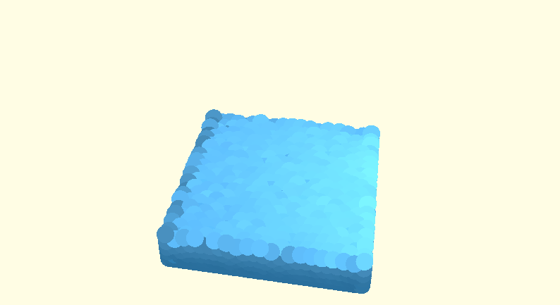
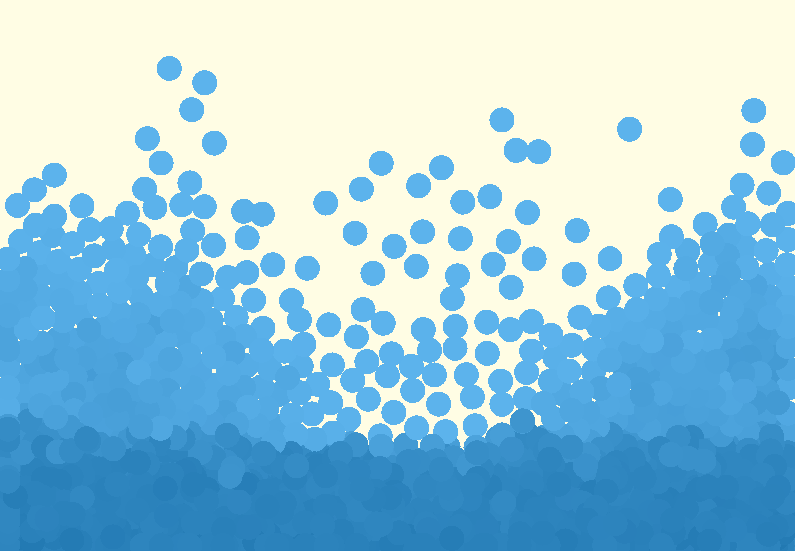

# RealWater

### Based on Muller's 2003 paper: 
[Particle-Based Fluid Simulation for Interactive Applications](https://matthias-research.github.io/pages/publications/sca03.pdf)

#### 3D splashing with phong lighting

#### 3D static with phong lighting

#### 2D splashing

